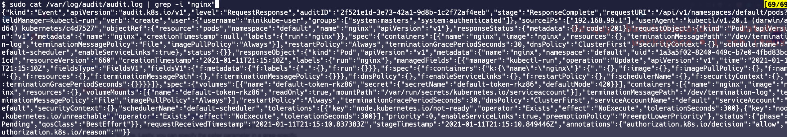

# 🤨 How to collect and visualize Kubernetes Audit logs using PLG(Promtail-Loki-Grafana) Stack?

First things first, we need to explain what Kubernetes Audit Logs are and what treasures are hidden inside of those for us, so let's get start with the explaining what Kubernetes Audit Logs are.

# Kubernetes Audit Logs 

As you already know, Kubernetes has a control plane to manage the whole cluster lifecycle and this control plane consists of more than one component. In my opinion, the Kubernetes API Serveris the most important component among them. Basically we consider that Kubernetes API Server is the brain of the cluster. So sometimes we want to know that what's happening inside of that brain 😅 

At this point, the "Kubernetes Audit Logs" comes in to the picture.

Kubernetes Audit Logs are the records that explains what's happening inside of this brain but if we look at them more technically the official documentation says "Kubernetes Audit logs provides a security-relevant, chronological set of records documenting the sequence of actions in a cluster.", so by collecting and analyzing them we can answer these following questions:

- What happened? 🐵 
- When did it happen? 🙈
- Who initiated it? 🙊 
- On what did it happen? 🙉
...

Because Kubernetes audit logs are detailed descriptions of each call made to the Kubernetes API-Server.So, these logs can help administrators to understand what event occurred, when did it take place and the trigger or the source of the event. At this point, a question may come to mind.What/Who actually causes of creating these kind of logs? Again as you already know, the API Serverprocesses requests from various components, sometimes these requests may be made from the components that lives inside of the cluster or by the utility called "kubectl" which is the command line utility provided by the Kubernetes. So each request that comes to the API Server generates an audit event. The important thing weneed to say that at this point is each request is recorded with an associated stage, these stages actually defines the time during which audit logs should occur.

Let's look at them real quick:
* RequestReceived: The stage for events generated as soon as the audit handler receives the request, and before it is delegated down the handler chain.
* ResponseStarted: Once the response headers are sent, but before the response body is sent. This stage is only generated for long-running requests (e.g. watch).
* ResponseComplete: The response body has been completed and no more bytes will be sent.
* Panic: Events generated when a panic occurred.
> Credit: https://kubernetes.io/docs/tasks/debug-application-cluster/audit

So nothing comes for free, right 😢 This auditing feature is disabled by default but if we want to enable this feature, there is a very important thing that we need to note here is the auditing functionality will cause to increase the memory consumption of the API server because these events may be huge json objects that depends of your audit logging configuration. So, how we can avoid these kind of situations, let's look at the [Audit Policies](https://kubernetes.io/docs/tasks/debug-application-cluster/audit/#audit-policy).

> Sometimes I can use "event" or "log" words to describe to concept here, so please don't get confused , these are all ok for describing this.

# Audit Policy
We can think of them as a filters that controls what Audit log can include. By using stages that we explained above we control the time during which event should occur and also by using policies we can define that content of the event. So limiting the content of that Audit log, we can avoid that kind of performance problems that may be happen on the API Server side. More techically, Audit policy defines rules about what events should be recorded and what data they should include. There is also a concept here called "Audit Level", so these levels are the actual thing that we define the data what event log should include. 

The defined audit levels are:
* None: don't log events that match this rule.
* Metadata: log request metadata (requesting user, timestamp, resource, verb, etc.) but not request or response body.
* Request: log event metadata and request body but not response body. This does not apply for non-resource requests.
* RequestResponse: log event metadata, request and response bodies. This does not apply for non-resource requests.
> https://kubernetes.io/docs/tasks/debug-application-cluster/audit/#audit-policy

The simple Audit Policy may look like this:
```yaml
# Log all requests at the Metadata level.
apiVersion: audit.k8s.io/v1
kind: Policy
rules:
- level: Metadata
```
Up to this point, we understand the concepts suchs as Audit Logs, Stages and Levels, but there is one more thing left we need to do. And that is we need to define where the audit logs shouldsent, so in order to do that we need to understand the concept called "Audit Backends", I promise that, this the last concept we need to cover to understand the whole process of Kubernetes Auditing 😇

# Audit Backend
Audit backend, simply defines where we want to send audit logs.The API Server prodives two backends to send logs and these are the following:
* Log Backend (which we are going to cover in this hands-on part): writes events into the filesystem
* Webhook backend: sends events to an external HTTP API

So, how we can define these kind of type backends for API Server to use, simple, just use the following kube-apiserver flags to configure these kind of backends
> More detail,if you want to look at all the flags that available for the kube-apiserver, you can visit the official documentation [here](https://kubernetes.io/docs/reference/command-line-tools-reference/kube-apiserver/).
For the type Log backend:
```yaml
--audit-policy-file=/etc/kubernetes/audit-policy.yaml \ # defines the details of the Audit Event, what they should include, when they should occur etc.
--audit-log-path=/var/log/audit.log #specifies the log file path that log backend uses to write audit events. Not specifying this flag disables log backend. - means standard out
```
> For more detail, you can visit the official documentation [here](https://kubernetes.io/docs/tasks/debug-application-cluster/audit/#audit-backends).

# Hands On
In this section, we're going to use Minikube as our local Kubernetes cluster then we write our policy file and define volume/volumeMounts for the Minikube to make it accessible by the Minikube's kubeapi-server, finally we can test the whole process by creating a pod and then displaying the audit logs for it.

> There is a good documentation avaible for this purpose on Minikube site in this [link](https://minikube.sigs.k8s.io/docs/tutorials/audit-policy/) if you want to take a look at but we don't follow this guide on this hands on section.

Let's start this hands on by creating our local Kubernetes cluster, in order to that we need to have "minikube" binary, if you havent' installed it yet, follow the [link](https://minikube.sigs.k8s.io/docs/start/).
```bash
$ minikube start
```

In this section, we're going to use this Audit Policy.
```yaml
apiVersion: audit.k8s.io/v1 # This is required.
kind: Policy
# Don't generate audit events for all requests in RequestReceived stage.
omitStages:
  - "RequestReceived"
rules:
  # Log pod changes at RequestResponse level
  - level: RequestResponse
    resources:
    - group: ""
      # Resource "pods" doesn't match requests to any subresource of pods,
      # which is consistent with the RBAC policy.
      resources: ["pods"]
  # Log "pods/log", "pods/status" at Metadata level
  - level: Metadata
    resources:
    - group: ""
      resources: ["pods/log", "pods/status"]

  # Don't log requests to a configmap called "controller-leader"
  - level: None
    resources:
    - group: ""
      resources: ["configmaps"]
      resourceNames: ["controller-leader"]

  # Don't log watch requests by the "system:kube-proxy" on endpoints or services
  - level: None
    users: ["system:kube-proxy"]
    verbs: ["watch"]
    resources:
    - group: "" # core API group
      resources: ["endpoints", "services"]

  # Don't log authenticated requests to certain non-resource URL paths.
  - level: None
    userGroups: ["system:authenticated"]
    nonResourceURLs:
    - "/api*" # Wildcard matching.
    - "/version"

  # Log the request body of configmap changes in kube-system.
  - level: Request
    resources:
    - group: "" # core API group
      resources: ["configmaps"]
    # This rule only applies to resources in the "kube-system" namespace.
    # The empty string "" can be used to select non-namespaced resources.
    namespaces: ["kube-system"]

  # Log configmap and secret changes in all other namespaces at the Metadata level.
  - level: Metadata
    resources:
    - group: "" # core API group
      resources: ["secrets", "configmaps"]

  # Log all other resources in core and extensions at the Request level.
  - level: Request
    resources:
    - group: "" # core API group
    - group: "extensions" # Version of group should NOT be included.

  # A catch-all rule to log all other requests at the Metadata level.
  - level: Metadata
    # Long-running requests like watches that fall under this rule will not
    # generate an audit event in RequestReceived.
    omitStages:
      - "RequestReceived"
```
To make it accessiable by the kube-apiserver we need to create volume/volumeMounts for it, also we need update the kube-apiserver flags to enable the auditing functionality
Let's first connect to our minikube instance that is running on VM by just simply using the "ssh" command.
```bash
$ minikube ssh
```
Then, let's create necessary folders and files within the minikube VM.
```bash
$ curl -sLO https://raw.githubusercontent.com/kubernetes/website/master/content/en/examples/audit/audit-policy.yaml
$ sudo mkdir -p /var/lib/k8s_audit
$ sudo mv audit-policy.yaml /var/lib/k8s_audit
```

Finally, let's configure the kubeapi-server itself
```bash
$ sudo vi /etc/kubernetes/manifests/kube-apiserver.yaml
```
First, add these part to exist volumeMounts section
```yaml
- mountPath: /var/lib/k8s_audit/audit-policy.yaml
  name: audit
  readOnly: true
- mountPath: /var/log/audit/audit.log
  name: audit-log
  readOnly: false
```
Then add volumes
```yaml
- name: audit
  hostPath:
    path: /var/lib/k8s_audit/audit-policy.yaml
    type: File

- name: audit-log
  hostPath:
    path: /var/log/audit/audit.log
    type: FileOrCreate
```

Finally, add the flags to commands section to enable auditing feature
```yaml
--audit-policy-file=/var/lib/k8s_audit/audit-policy.yaml
--audit-log-path=/var/log/audit/audit.log
```

Let's watch our API Server to if it is up and running correctly
```bash
$ kubectl get pods -n kube-system -w
```

If everything is working, let's continue with the creating a new pod and displaying audit logs for it
```bash
$ kubectl run nginx --image=nginx --generator=run-pod/v1
```

Again, we need to connect to our minikube instance, if everything goes fine we need to see a new file called audit.log within the folder /var/log/audit
```bash
$ minikube ssh
$ cat /var/log/audit/audit.log | grep -i "nginx"
```

We should the see audit logs for the event of creating nginx Pod like the following screenshot


